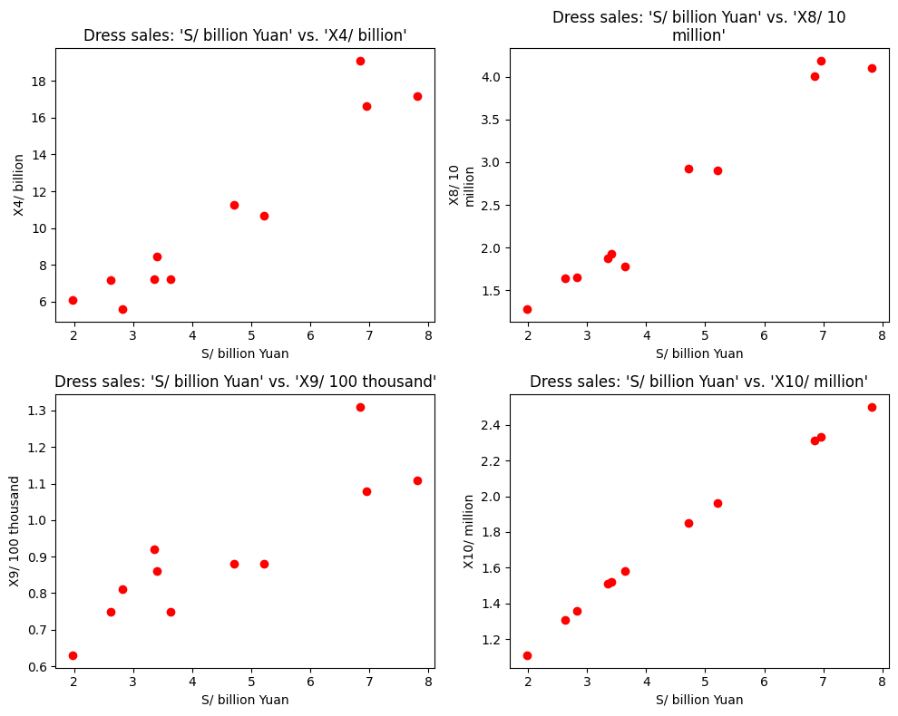
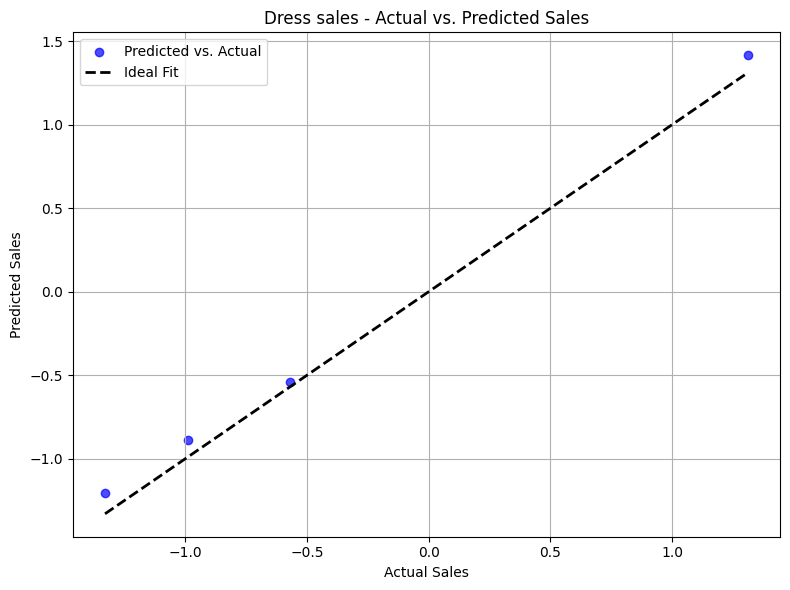

# Sales Analysis and Forecasting for E-Commerce Platforms

## Project Overview
This project aims to enhance e-commerce platform performance by leveraging sales data to identify trends, predict future sales, and support merchants in crafting effective strategies. Using historical data from May 2016 to April 2019, this analysis combines machine learning, time series modeling, and statistical methods to deliver actionable insights.

---

## Dataset
The dataset comprises sales data across various clothing categories. Features include:
- **S (Sales)**: Sales volume (unit: billion Yuan)
- **X4**: Page views (unit: billion)
- **X8**: Additional purchases (unit: 10 million)
- **X9**: Customer group index (unit: 100 thousand)
- **X10**: Transaction index (unit: million)

---

## Key Analyses

### 1. **Data Cleaning**
   - Removed duplicates and handled missing values using imputation.

### 2. **Outlier Detection**
   - Identified outliers through boxplots and Z-scores.
   
   
   

### 3. **Feature Scaling**
   - Standardized features using Z-score normalization for consistent scaling.

### 4. **Correlation Analysis**
   - Explored inter-feature relationships via heatmaps and scatter plots.
   
   
   

### 5. **Principal Component Analysis (PCA)**
   - Dimensionality reduction to simplify the dataset while retaining over 95% of the variance.
   
   
   

---

## Prediction Models

### **Synthetic Time Series**
   - Created a synthetic time series with added trend and seasonality to simulate sales data.  
   - Used this synthetic series as the foundation to build and enhance the main time series for further analysis.  
   

### **Time Series Modeling**
#### **Time Series Decomposition**
   - Decomposed the main time series into trend, seasonal, and residual components for analysis.  
   

#### **Holt-Winters Exponential Smoothing**
   - Built a forecasting model using Holt-Winters Exponential Smoothing.  
   - Captured seasonal trends and forecasted future sales with high accuracy.  
     
     
   

#### **ARIMA**
   - Built and fine-tuned ARIMA models for advanced time series forecasting.
   - Leveraged residual analysis to validate model predictions.
   - 

---

### **Linear Regression**
   - Implemented **Linear Regression** to predict sales using key features.
   - Evaluated model performance using R² scores and compared predicted sales with actual sales.
   - Provided functionality to predict sales for a specific date and category based on input features.
   
   
   
   
   
   

---

## Results
- The **Linear Regression** model delivered high R² values across categories, reflecting accurate feature-based predictions.
- **Holt-Winters** effectively captured seasonal variations in sales data.
- **ARIMA** demonstrated robust forecasting for future sales with validated residuals.
- **Synthetic Time Series** provided an adaptable foundation for time series analysis.
- Visualizations highlighted trends, outliers, and predicted versus actual sales.

---

## Visualizations
The notebook includes:
- Detailed boxplots for outlier detection.
- Heatmaps to examine feature correlations.
- PCA plots for feature selection.
- Decomposition plots showcasing trends and seasonality.
- Forecasting charts comparing predictions to actual sales data.

---

